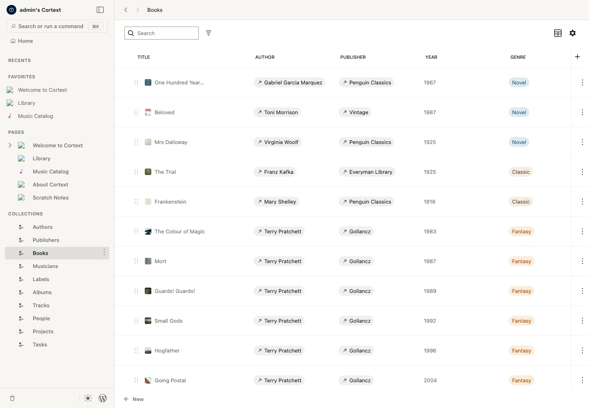

# Cortext

> [!WARNING]
> Cortext is an early beta. Try it somewhere low-stakes first.
>
> Some things may change during the beta, so do not make it the only place for important work yet.

A WordPress plugin for building a knowledge base inside your own site: nested pages, typed collections, multiple views, and publishing through WordPress.



## Why

WordPress already has the hard parts: ownership, publishing, export, themes, and a data model people can inspect without Cortext. This project tries to make those pieces feel like one knowledge base instead of a pile of admin screens.

Because it is still WordPress, Cortext can publish knowledge base entries as themed public pages, run locally, and keep data in ordinary WordPress storage.

## How it works, in one paragraph

Cortext stores documents, collection definitions, fields, and collection rows as WordPress posts and post meta. The admin UI is a React shell that combines a WordPress block editor for documents with collection views built on WordPress packages.

## Docs

-   [Getting started](docs/getting-started.md): install, run, day-to-day commands.
-   [Release process](docs/release.md): milestones, labels, and changelog previews.
-   [Vision and principles](docs/vision.md): what drives the design.
-   [Architecture](docs/architecture.md): current storage and shell overview.
-   [Shell architecture](docs/architecture/shell.md): React shell, mount point, editor setup.
-   [Data model](docs/architecture/data-model.md): implementation notes and current status.
-   [Theming](docs/theming.md): shell vs content themes, and current token notes.
-   [Roadmap](docs/roadmap.md): what ships when.

## Requirements

-   WordPress 6.9+
-   PHP 8.1+
-   A recent block theme is recommended but not required.

## Development

Quick start:

```
./scripts/setup.sh   # install deps, assign a per-worktree port
./scripts/run.sh     # boot wp-env, seed demo data, start the JS watcher
./scripts/archive.sh # stop the detached wp-env environment
```

Runs on Docker via wp-env. Parallel worktrees get deterministic per-path ports so branches and agents do not collide. Demo data is opt-in: `./scripts/run.sh` and `pnpm run env:start:seed` seed it; plain `wp-env start` does not. Full workflow, contribution notes, and command reference in [Getting started](docs/getting-started.md).
